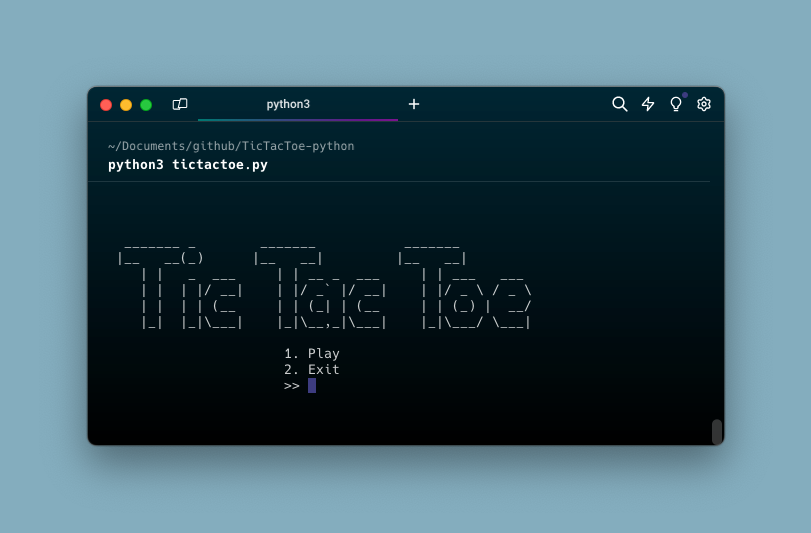

# TicTacToe Python Game

## Description
This TicTacToe game is a simple, text-based version of the classic game implemented in Python. It allows two players to play TicTacToe against each other on the command line.

## Live Preview

[Can be viewed via Replit.](https://replit.com/@VJGIELILLUWAN/TicTacToe-python?v=1)

## Installation
1. Clone this repository to your local machine using `git clone https://github.com/your-username/tictactoe-python.git`.
2. Navigate to the cloned directory.
3. Run `python ticTacToe.py` to start the game.

## Requirements
- Python 3.x

## How to Play
1. Choose the 'Play' option from the main menu.
2. Player 1 will use 'X' and Player 2 will use 'O'.
3. Players simply enter the number of the square they want to mark.
4. 4. The first player to get 3 of their marks in a row (up, down, across, or diagonally) is the winner.

   
https://github.com/emrecengdev/TicTacToe-python/assets/76089961/7d561c8a-8efc-4b6f-a45e-7c1e77b66a1f

## Contributing
Contributions are welcome! For major changes, please open an issue first to discuss what you would like to change.

## License
[MIT](https://choosealicense.com/licenses/mit/)

